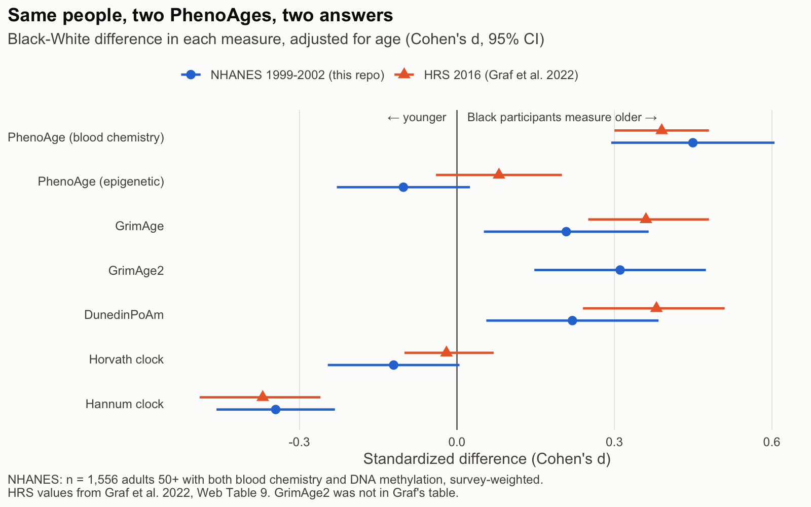
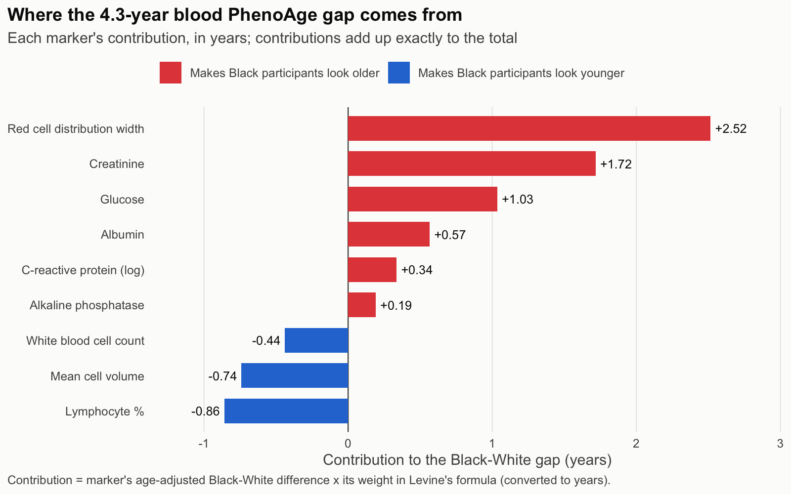

# BloodVsMethylation

A replication, in a second national sample, of one finding in ["Testing Black-White Disparities in Biological Aging Among Older Adults in the United States: Analysis of DNA-Methylation and Blood-Chemistry Methods"](https://doi.org/10.1093/aje/kwab281) (Graf et al., *American Journal of Epidemiology*, 2022), followed by an attempt to explain it.

The finding: in the same people, two versions of Levine's PhenoAge disagree about race. The blood-chemistry version, built from nine routine lab values, says Black participants are about 2.8 years further ahead of their chronological age than White participants. The epigenetic version, built from DNA methylation and trained toward the same target, finds essentially no gap. Graf et al. report both numbers in their supplement (Web Tables 1 and 9) but never compare them.

This repo asks two questions. Does the disagreement reproduce outside the Health and Retirement Study? And if it does, which of the nine blood markers produce the blood-chemistry gap?

## Data

Everything here is public and downloads without registration or a data use agreement. `R/01_pull_data.R` fetches it all.

| Source | What it provides |
|---|---|
| NHANES 1999-2000 and 2001-2002 demographics, biochemistry, CRP, and complete blood count files | The nine PhenoAge blood markers, age, sex, race/ethnicity, survey design variables |
| NHANES DNA methylation epigenetic biomarkers file (`dnmepi.sas7bdat`, released July 2024) | 13 epigenetic clocks, including epigenetic PhenoAge, GrimAge, GrimAge2, and DunedinPoAm, for adults 50+ from the same two cycles, with their own survey weight (`WTDN4YR`) and methylation-estimated blood cell proportions |
| NCHS public-use linked mortality files | Deaths through December 31, 2019 |

The analytic sample is the 1,556 non-Hispanic White (1,022) and non-Hispanic Black (534) adults aged 50 and older with usable methylation data and all nine blood markers (`output/tables/sample_flow.csv`). All estimates use the methylation subsample weights and NHANES's strata and PSUs.

## How this differs from Graf et al.

| Graf et al. | This repo | Why |
|---|---|---|
| HRS 2016 Venous Blood Study, ages 50-90 | NHANES 1999-2002, ages 50-85 (NHANES top-codes age at 85) | NHANES is the only public sample I found with blood chemistry and epigenetic clocks measured in the same people |
| Blood PhenoAge computed with the BioAge R package | Computed directly from Levine's published coefficients | Same formula. I use its closed form, which never overflows; the published two-step form returns infinity for 7 of the highest-risk participants here (see "Sensitivity" below) |
| Three blood-chemistry measures (PhenoAge, KDM, homeostatic dysregulation) | PhenoAge only | KDM and homeostatic dysregulation need training in NHANES III; left for later |
| Mediation analysis of health outcomes | Not attempted | Not needed for the question this repo asks |

"Age advancement" follows Graf et al.: the residual from a regression of each biological age on chronological age, fit once in the analytic sample. DunedinPoAm is a rate and is used as-is, as they did.

## Result 1: the disagreement reproduces



| Measure | White | Black | Gap (years) | Cohen's d (95% CI) | Graf et al. d |
|---|---|---|---|---|---|
| PhenoAge, blood chemistry | -1.66 | +2.66 | **+4.32** | **0.45** (0.29, 0.60) | 0.39 |
| PhenoAge, epigenetic | +0.18 | -0.51 | **-0.69** | **-0.10** (-0.23, 0.02) | 0.08 |
| GrimAge | -0.60 | +0.44 | +1.04 | 0.21 (0.05, 0.37) | 0.36 |
| GrimAge2 | -0.78 | +0.91 | +1.69 | 0.31 (0.15, 0.47) | not reported |
| DunedinPoAm (pace) | 1.10 | 1.12 | +0.02 | 0.22 (0.06, 0.38) | 0.38 |
| Horvath | +0.13 | -0.52 | -0.65 | -0.12 (-0.25, 0.00) | -0.02 |
| Hannum | +0.56 | -1.35 | -1.91 | -0.35 (-0.46, -0.23) | -0.37 |

Every measure points the same direction it does in Graf et al., and the blood-versus-epigenetic PhenoAge split is, if anything, wider here: about 5 years apart in NHANES against about 2.6 in HRS. Full output in `output/tables/gap_by_clock.csv`.

The epigenetic result also matches [a 2025 PLOS ONE analysis](https://doi.org/10.1371/journal.pone.0327010) of the same NHANES methylation file, which found no White-Black difference in epigenetic PhenoAge. That paper does not compute the blood-chemistry version.

## Result 2: where the blood-chemistry gap comes from

Levine's formula makes blood PhenoAge exactly linear in its nine markers (substituting the mortality score into the age formula cancels both logarithms), and residualizing on age is a linear operation. So the Black-White gap splits into one additive piece per marker, in years, with nothing left over: each marker's age-adjusted group difference times its weight in the formula. `decompose_gap()` in `R/utils_phenoage.R` does this, and a test checks that the pieces sum to the total.



| Marker | Age-adjusted Black-White difference | Contribution (years) |
|---|---|---|
| Red cell distribution width | +0.69 % | **+2.52** |
| Creatinine | +16.3 umol/L | **+1.72** |
| Glucose | +0.48 mmol/L | +1.03 |
| Albumin | -1.52 g/L | +0.57 |
| C-reactive protein (log) | +0.32 | +0.34 |
| Alkaline phosphatase | +9.1 U/L | +0.19 |
| White blood cell count | -0.71 x10^3/uL | -0.44 |
| Mean cell volume | -2.49 fL | -0.74 |
| Lymphocyte % | +6.46 | -0.86 |
| **Total** | | **+4.32** |

Two things here I expected, and one I did not.

**Expected: creatinine pushes the gap up.** Creatinine rises with muscle mass as well as with declining kidney function, and it runs higher on average in Black adults, which is why kidney-function equations dropped their race coefficient in 2021. PhenoAge reads higher creatinine as older.

**Expected: the white-cell pair pushes the gap down.** Together, WBC count and lymphocyte % subtract 1.3 years. Result 3 below shows why this looks like the Duffy-null footprint.

**Not expected: red cell distribution width is the largest single contributor**, at 2.5 of the 4.3 years. RDW carries the heaviest per-unit weight in the formula (3.7 years per percentage point), and Black participants average 0.69 points higher. I have not established why. Whether that difference reflects aging, or something that is not aging (for example, inherited red-cell traits that are more common in people of African ancestry, or iron status), is the most important open question this repo raises, and I am not going to guess at it here. Mean cell volume, which moves with some of the same red-cell traits, runs the other way (-0.74 years).

Full output in `output/tables/blood_phenoage_decomposition.csv`.

## Result 3: the white-cell markers carry the Duffy-null footprint

NHANES has no Duffy genotype, so this checks for its known signature instead.

| | White | Black |
|---|---|---|
| WBC (10^3/uL) | 7.14 | 6.41 |
| Neutrophils, absolute (10^3/uL) | 4.33 | 3.46 |
| Lymphocytes, absolute (10^3/uL) | 1.97 | 2.19 |
| Share with neutrophils below 1.5 x10^3/uL | 0.3% | 4.1% |
| Neutrophil proportion, methylation-estimated | 0.61 | 0.53 |

The lower white count among Black participants is almost entirely neutrophils, lymphocytes run slightly higher, and a neutrophil count below the conventional neutropenia threshold is more than ten times as common. That is the published Duffy-null pattern. The methylation-estimated neutrophil share, from a different assay on a different sample type, agrees. Full output in `output/tables/neutrophils_by_race.csv`.

This is a footprint, not a genotype. It shows the white-cell markers behave the way Duffy-null would make them behave; it cannot say how many participants carry it.

## Result 4: what each suspect marker adds to mortality prediction

If a marker's racial difference is measurement rather than aging, removing it should shrink the gap without costing much mortality prediction. `R/06_mortality.R` holds marker sets at the sample mean (removing their contribution for everyone), then fits design-weighted Cox models on 907 deaths among 1,556 participants.

| Blood PhenoAge variant | Gap (years) | HR per SD, all | HR, White | HR, Black | Race x measure interaction p |
|---|---|---|---|---|---|
| Published (all nine markers) | 4.32 | 1.47 (1.36, 1.58) | 1.51 | 1.36 | 0.33 |
| Creatinine held at mean | 2.60 | 1.47 (1.36, 1.58) | 1.48 | 1.41 | 0.86 |
| WBC + lymphocyte % held at mean | 5.62 | 1.45 (1.35, 1.56) | 1.49 | 1.35 | 0.33 |
| RDW + MCV held at mean | 2.54 | 1.44 (1.34, 1.54) | 1.46 | 1.37 | 0.62 |
| All five held at mean | 2.13 | 1.28 (1.19, 1.37) | 1.29 | 1.24 | 0.66 |

Removing creatinine takes 1.7 years off the gap and costs nothing measurable in mortality prediction. Removing RDW and MCV takes 1.8 years off and costs a little. Removing all five costs a lot, so these markers carry real mortality information together, even if part of their racial difference is not aging.

No variant shows a significant race-by-measure interaction. That is the kind of check Graf et al. used to argue the measures work equally well across groups, and it gives the same answer for a score with a 2.1-year gap and one with a 5.6-year gap.

For comparison, epigenetic PhenoAge predicts death at HR 1.35 per SD with no gap; GrimAge2 predicts best of everything here (HR 1.71) with a 1.7-year gap. Full output in `output/tables/mortality_by_measure.csv`.

"Held at mean" is my choice, not a refit: it removes a marker's contribution without re-estimating the other eight weights, so these are sensitivity checks on Levine's published score, not new scores.

## Result 5: Graf et al.'s precision checks cannot see a level shift

Graf et al.'s supplement argues that differential measurement precision is unlikely because (a) biological-age SDs are similar in the two groups, and (b) race-by-measure interaction tests on health outcomes resemble the same tests run on chronological age. Both checks are about spread and slope. Neither looks at the mean.

`R/07_level_shift_simulation.R` makes that concrete. It copies the White participants into a synthetic second group: the same people, ages, and deaths, with only their markers shifted by the Black-White differences observed above. The two groups are biologically identical by construction, so any gap is pure measurement.

| Markers shifted | Gap created (years) | SD, original | SD, shifted copy | HR, original | HR, shifted copy | Interaction coefficient |
|---|---|---|---|---|---|---|
| Creatinine | 1.72 | 8.64 | 8.64 | 1.38 | 1.38 | 0 |
| RDW + MCV | 1.77 | 8.64 | 8.64 | 1.38 | 1.38 | 0 |
| All nine | 4.32 | 8.64 | 8.64 | 1.39 | 1.39 | 0 |

A 4.3-year gap that is entirely artifact passes both checks perfectly: identical SDs, identical hazard ratios, and an interaction coefficient of zero to machine precision. The outcome model's group term absorbs the shift exactly, which is why any model that adjusts for race cannot detect one.

This does not show the real gap is an artifact. It shows those two checks cannot tell either way.

## Sensitivity

| Scenario | n | Blood gap | Epigenetic gap | RDW | Creatinine | White-cell pair |
|---|---|---|---|---|---|---|
| Main analysis | 1,556 | 4.32 | -0.69 | 2.52 | 1.72 | -1.30 |
| Drop the 7 two-step-infinite participants | 1,549 | 3.67 | -0.69 | 2.35 | 1.19 | -1.31 |
| Winsorize markers at 1%/99% | 1,556 | 3.39 | -0.69 | 2.45 | 1.06 | -1.30 |
| Unweighted | 1,556 | 3.99 | -0.66 | 2.39 | 1.74 | -1.35 |

RDW's contribution, the white-cell pair, and the epigenetic gap are stable. **Creatinine is not.** Its contribution falls from 1.7 to about 1.1 years once a handful of extreme values are dropped or trimmed, which suggests a few participants with very high creatinine, likely advanced kidney disease, carry part of it. The blood-chemistry gap stays between 3.4 and 4.3 years in every scenario. Full output in `output/tables/sensitivity.csv`.

## What this does not show

- **That the blood-chemistry gap is wrong.** It shows the gap depends on the instrument, and that most of it comes from three markers with known non-aging reasons to differ by race or ancestry. Some or all of those differences could still reflect real differences in health.
- **That epigenetic PhenoAge is the unbiased one.** [Philibert et al. 2020](https://doi.org/10.3390/genes11060685) found ancestry-linked methylation sites inside the epigenetic PhenoAge index itself. Two instruments disagreeing does not say which one is right.
- **Anything about Duffy genotype directly.** Result 3 is a footprint.
- **Why RDW differs.** See Result 2.
- **Numbers that match Graf et al.'s exactly.** Different survey, different years, different age range. The claim is that the shape reproduces.

The public-use mortality files are deliberately perturbed by NCHS for privacy (synthetic follow-up time or cause of death for select records), so hazard ratios will not match an analysis on the restricted files exactly.

## Still open

- The RDW question, above everything else.
- KDM biological age and homeostatic dysregulation, trained in NHANES III as Graf et al. did, to see whether the same markers drive those gaps.
- Creatinine against lean mass: NHANES 1999-2004 has DXA body composition (multiply imputed), which could separate muscle mass from kidney function directly.
- An exact rebuild of Graf et al.'s own numbers from HRS, whose epigenetic clocks are public; I have not confirmed access terms for the 2016 blood chemistry.

## Running it

```
nix develop --command Rscript run_all.R
```

`R/01_pull_data.R` downloads about 25MB into `data_raw/` (gitignored) and caches it. Everything else reads from there.

## Tests

`tests/testthat/` checks the logic this repo adds: that the closed-form PhenoAge matches the published two-step formula wherever the latter is finite, that each marker moves PhenoAge by its documented slope, that the decomposition sums exactly to the total gap and attributes a pure shift to the shifted marker alone, that the download helper rejects error pages and truncated files, and schema and unit invariants on the committed `data_processed/` file.

```
nix develop --command Rscript tests/testthat.R
```

## License

The code in this repository (everything under `R/`, `run_all.R`, `tests/`) is MIT-licensed; see `LICENSE`. The derived data under `data_processed/` and `output/tables/` is built from NHANES and NCHS linked mortality public-use files, which are US government works; follow NCHS's data use restrictions, including never attempting to identify any participant. The raw downloads (`data_raw/`) are gitignored and not part of this repository.
